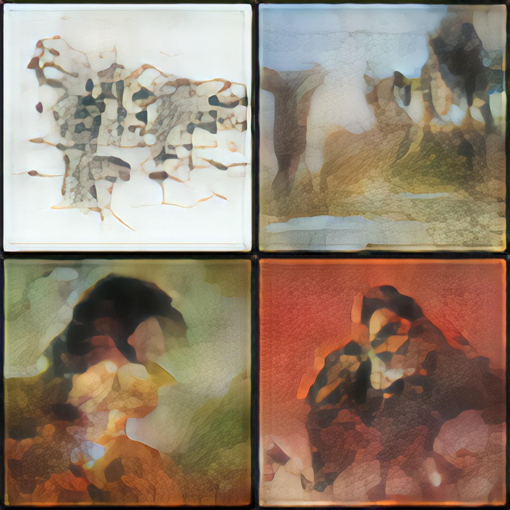
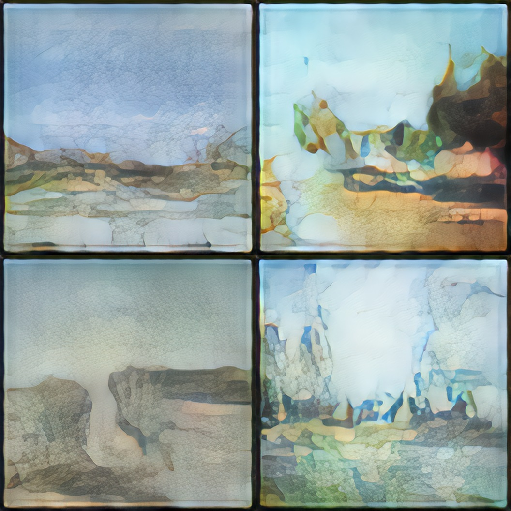

## A Generative Adversarial Network(GAN) that generates new pictures. Created with PyTorch
### This project was done by: 
https://github.com/plazinho  
https://github.com/IlyaGaluzinskiy  
https://github.com/aabdysheva  
### Dataset 
- The dataset from Kaggle - [Best Artworks of All Time](https://www.kaggle.com/ikarus777/best-artworks-of-all-time)  
- We took images related to artists who wrote in **Impressionism and Post-Impressionism** style (approximately 2400 pictures)
- All images were resized to 64x64 resolution
### Model
- Discriminator has 5 convolutional layers with BatchNorm and LeakyReLU activation function. The final activation function was Sigmoid. 
- Generator has 5 transposed convolutional layers with BatchNorm and ReLU activation function. The final activation function - Tanh. 
- Training for 150 epochs on Google Colab took ~ 3 hours
### Image super-resolution
- We used [pretrained model](https://github.com/idealo/image-super-resolution) to resize pictures and improve their quality 
- Super-resolution was applied to manually selected pictures
### Results
- some other resulting pics you can see in [pictures folder](https://github.com/aabdysheva/Art_Generation/tree/main/pictures)

